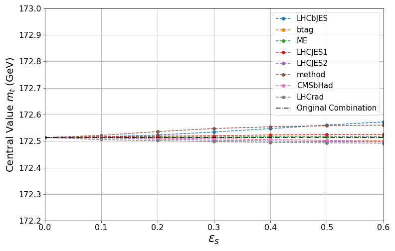

# Top-Mass Combination Tutorial

This tutorial mirrors the notebook `top-mass-combination.ipynb` and shows how to:
- run the baseline LHC combination,
- study the dependence of the result on the error-on-error (ε) for each systematic,
- repeat the study including a fictitious additional measurement.

## Setup

```python
import os
import sys

import numpy as np
import matplotlib.pyplot as plt

from IPython.display import display, Latex

script_dir = os.getcwd()
gvm_root = os.path.abspath(os.path.join(script_dir, '../../'))
sys.path.insert(0, gvm_root)

from gvm.gmv import GVMCombination
from gvm.config import build_input_data
```

## Baseline LHC combination

```python
data = build_input_data('input_files/LHC_comb.yaml')

comb_fict = GVMCombination(data)

comb           = GVMCombination(data)

comb.fit()
mu_hat         = comb.fit_results.mu
ci_low, ci_high, ci_half = comb.confidence_interval()
chi2           = comb.goodness_of_fit()
ndof           = comb.n_meas - 1

latex_str = rf"""
\[
  {{\large\textbf{{BLUE result}}}}\\[8pt]
  \boxed{{\quad
    \begin{{aligned}}
      \mathrm{{central\ value}}\,(m_t):\ &{mu_hat:.3f}\\[6pt]
      \mathrm{{confidence\ interval}}:\ &\pm{ci_half:.3f}\\[6pt]
      \chi^2/\mathrm{{NDOF}}:\ &{chi2:.2f}/{ndof}
    \end{{aligned}}
  \quad}}
\]
"""

display(Latex(latex_str))
```

### Scan ε per systematic (dependent type)

```python
systematics = ['LHCbJES', 'btag', 'ME', 'LHCJES1', 'LHCJES2', 'method', 'CMSbHad', 'LHCrad']
eps_grid = np.linspace(0.0, 0.6, 7)

base_mu = comb.fit_results.mu
base_ci = comb.confidence_interval()[2]

cv = {s: [] for s in systematics}
ci = {s: [] for s in systematics}

for syst in systematics:
    info = comb.get_input_data(copy=True)
    info.uncertain_systematics.clear()
    info.eoe_type[syst] = 'dependent'
    for eps in eps_grid:
        info.uncertain_systematics[syst] = eps
        comb.set_input_data(info)
        cv[syst].append(comb.fit_results.mu)
        ci[syst].append(comb.confidence_interval()[2])
```

```python
plt.figure(figsize=(11,7))
for s in systematics:
    plt.plot(eps_grid, cv[s], '--o', label=s)
plt.axhline(base_mu, color='black', linestyle='dashdot', label='Original Combination')
plt.xlabel(r'$\\epsilon_s$', fontsize=24)
plt.ylabel('Central Value $m_t$ (GeV)', fontsize=20)
plt.xlim(0.0, 0.6)
plt.ylim(172.2, 173.)
plt.legend(fontsize=15)
plt.grid(True)
plt.tick_params(axis='both', which='major', labelsize=16)
plt.tight_layout()

plt.savefig("output/central_values.png")
plt.show()
```

```python
plt.figure(figsize=(11,7))
for s in systematics:
    plt.plot(eps_grid, ci[s], '--o', label=s)
plt.axhline(base_ci, color='black', linestyle='dashdot', label='Original Combination')
plt.xlabel(r'$\\epsilon_s$', fontsize=24)
plt.ylabel('$68.3\\%$ Half-Size Confidence Interval (GeV)', fontsize=20)
plt.xlim(0.0, 0.6)
plt.ylim(0., 0.5)
plt.legend(fontsize=15, loc='lower left')
plt.grid(True)
plt.tick_params(axis='both', which='major', labelsize=16)
plt.tight_layout()

plt.savefig("output/confidence_intervals.png")
plt.show()
```




## Combination with fictitious measurement

```python
data = build_input_data('input_files/LHC_comb_fictitious_meas.yaml')

comb_fict = GVMCombination(data)

comb_fict.fit()
mu_hat = comb_fict.fit_results.mu
ci_low, ci_high, ci_half = comb_fict.confidence_interval()
chi2 = comb_fict.goodness_of_fit()
ndof = comb_fict.n_meas - 1

latex_str = rf"""
\[
  {{\large\textbf{{BLUE result}}}}\\[8pt]
  \boxed{{\quad
    \begin{{aligned}}
      \mathrm{{central\ value}}\,(m_t):\ &{mu_hat:.3f}\\[6pt]
      \mathrm{{confidence\ interval}}:\ &\pm{ci_half:.3f}\\[6pt]
      \chi^2/\mathrm{{NDOF}}:\ &{chi2:.2f}/{ndof}
    \end{{aligned}}
  \quad}}
\]
"""

display(Latex(latex_str))
```

### Scan ε per systematic (dependent type, with NEW)

```python
systematics = ['NEW', 'LHCbJES', 'btag', 'ME', 'LHCJES1', 'LHCJES2', 'method', 'CMSbHad', 'LHCrad']
eps_grid = np.linspace(0., 0.6, 7)

base_mu = comb_fict.fit_results.mu
base_ci = comb_fict.confidence_interval()[2]

cv_fict = {s: [] for s in systematics}
ci_fict = {s: [] for s in systematics}

for syst in systematics:
    info = comb_fict.get_input_data(copy=True)
    info.uncertain_systematics.clear()
    info.eoe_type[syst] = 'dependent'
    for eps in eps_grid:
        info.uncertain_systematics[syst] = eps
        comb_fict.set_input_data(info)
        cv_fict[syst].append(comb_fict.fit_results.mu)
        ci_fict[syst].append(comb_fict.confidence_interval()[2])
```

```python
plt.figure(figsize=(11,7))
for s in systematics:
    plt.plot(eps_grid, cv_fict[s], '--o', label=s)
plt.axhline(base_mu, color='black', linestyle='dashdot', label='Original Combination')
plt.xlabel(r'$\\epsilon_s$', fontsize=24)
plt.ylabel('Central Value $m_t$ (GeV)', fontsize=20)
plt.xlim(0.0, 0.6)
plt.ylim(172.4, 173.9)
plt.legend(fontsize=15)
plt.grid(True)
plt.tick_params(axis='both', which='major', labelsize=16)
plt.tight_layout()

plt.savefig("output/central_values_fict.png")
plt.show()
```

```python
plt.figure(figsize=(11,7))
for s in systematics:
    plt.plot(eps_grid, ci_fict[s], '--o', label=s)
plt.axhline(base_ci, color='black', linestyle='dashdot', label='Original Combination')
plt.xlabel(r'$\\epsilon_s$', fontsize=24)
plt.ylabel('$68.3\\%$ Half-Size Confidence Interval (GeV)', fontsize=20)
plt.xlim(0.0, 0.6)
plt.ylim(0., 0.5)
plt.legend(fontsize=15, loc='lower left')
plt.grid(True)
plt.tick_params(axis='both', which='major', labelsize=16)
plt.tight_layout()

plt.savefig("output/confidence_intervals.png")
plt.show()
```


