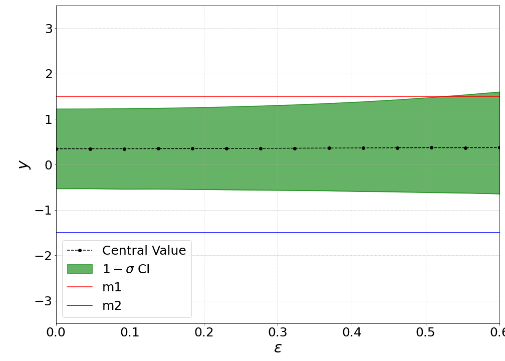
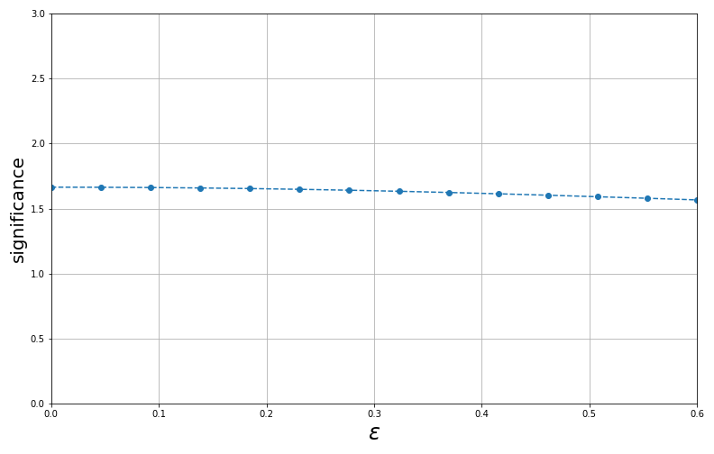
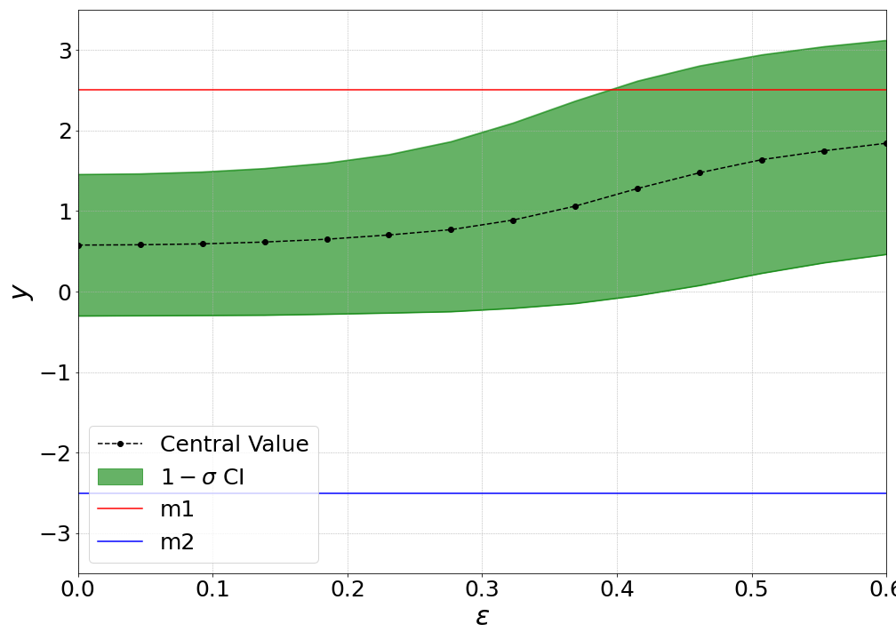
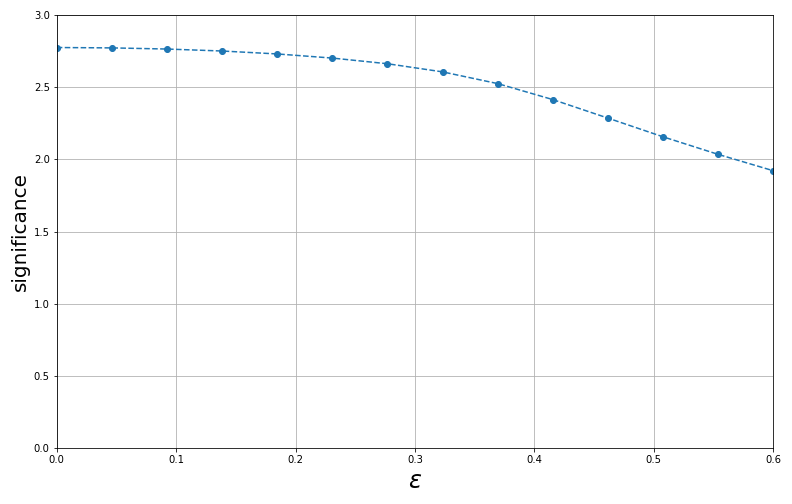
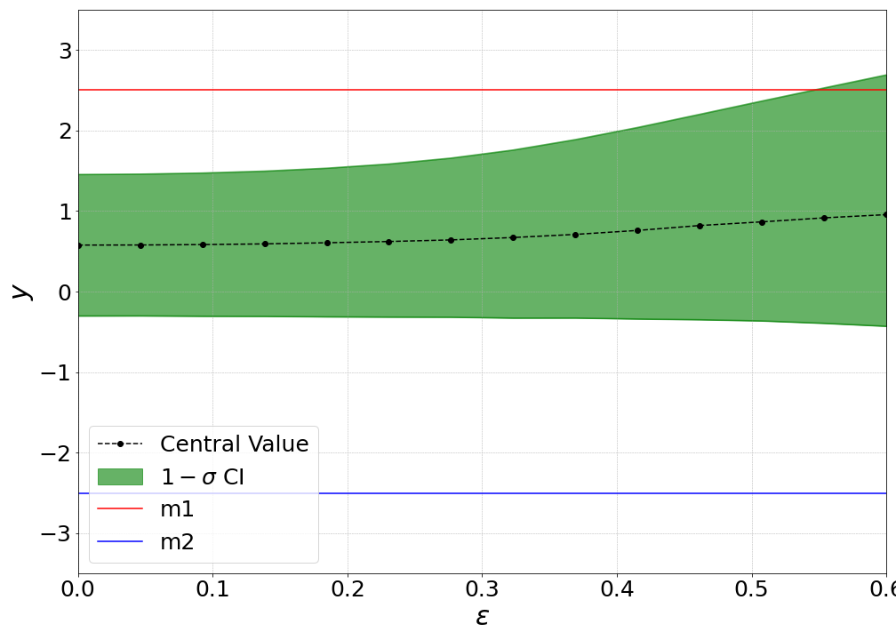
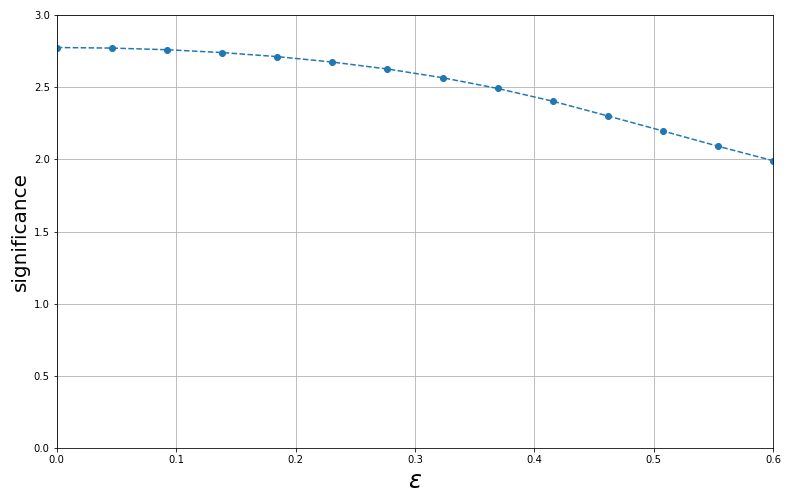
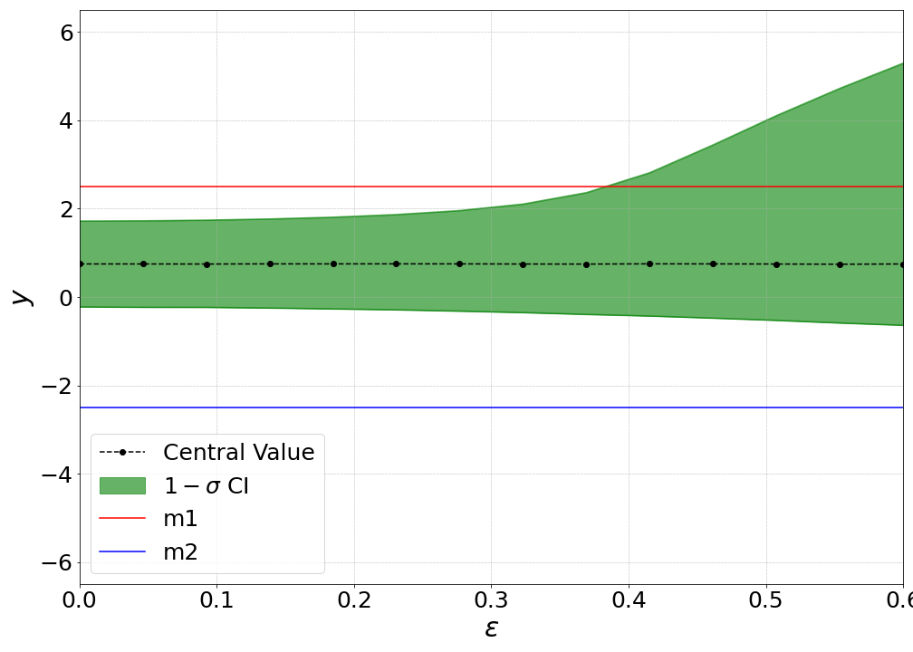
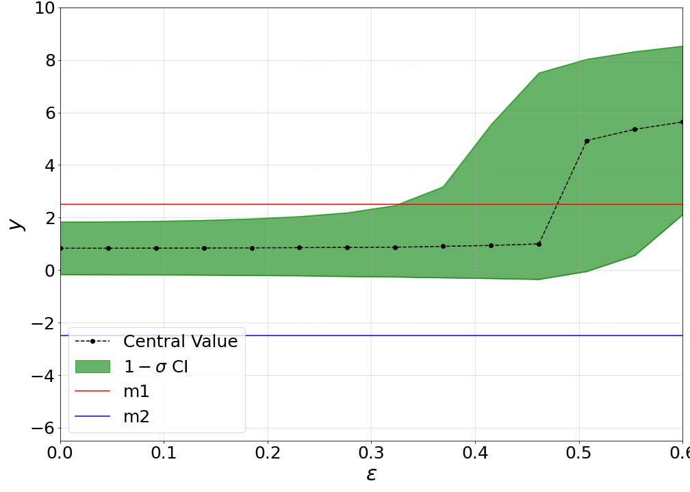

# Toy Correlation Tutorial

In this notebook, we explore how different correlation assumptions affect a simple two-measurement combination. Both measurements estimate the same quantity, with central values \( y_1 = 1.5 \) and \( y_2 = -1.5 \). Their statistical uncertainties are \( \sigma_{y_1} = \sigma_{y_2} = 1 \). We introduce a single systematic source with magnitudes \( \Gamma_1 = 0.5 \) and \( \Gamma_2 = 1 \), so that the first measurement has a smaller total uncertainty.

In the first part of the tutorial, all error-on-error terms (\( \varepsilon \)) are set to zero, so that only correlations influence the result. In the second part, we show how to introduce and account for errors-on-errors.

For systematic uncertainties without an associated error-on-the-error, the log-likelihood is constructed using the BLUE approach, as described in Sec. 2 of [arXiv:2407.05322](https://arxiv.org/abs/2407.05322). 


```python
import os, sys
import numpy as np
import matplotlib.pyplot as plt
from scipy.stats import chi2, norm
from copy import deepcopy

script_dir = os.getcwd()
gvm_root = os.path.abspath(os.path.join(script_dir, "../../"))
if gvm_root not in sys.path:
    sys.path.insert(0, gvm_root)

from gvm_toolkit import GVMCombination
```

# No errors-on-errors

The following cells build a `GVMCombination` for each correlation scenario. After running the fit we print the estimated mean (`mu_hat`), the 68% confidence interval and the goodness-of-fit (chi-square) value.


## 1. Decorrelated case
Here the systematic uncertainty is defined as independent for each measurement (no correlation matrix).

The full configuration file `decorrelated.yaml` is:
```yaml
global:
  name: decorrelated
  n_meas: 2
  n_syst: 1
  corr_dir: tutorials/toy/input_files/correlations

data:
  measurements:
    - label: m1
      central: 1.5
      stat_error: 1.0
    - label: m2
      central: -1.5
      stat_error: 1.

syst:
  - name: sys1
    shifts: [0.5, 1.0]
    type: independent
    epsilon: 0.0
```


```python
comb = GVMCombination('input_files/decorrelated.yaml')

mu_hat = comb.fit_results['mu']
ci_low, ci_high, _ = comb.confidence_interval()

chi_2 = comb.goodness_of_fit()
p_value = 1 - chi2.cdf(chi_2, df=1)
significance = norm.ppf(1 - p_value/2)

print('Decorrelated')
print(f'mu_hat = {mu_hat:.4f}, CI = ({ci_low:.4f}, {ci_high:.4f})')
print(f'χ² = {chi_2:.3f}, significance = {significance}')
```

    Decorrelated
    mu_hat = 0.3462, CI = (-0.5332, 1.2230)
    χ² = 2.769, significance = 1.6641005886756863


## 2. Correlation examples

We now compare three different correlation matrices for the systematic uncertainty:
1. **Diagonal**: off-diagonal terms are zero so the systematic acts independently.
2. **Hybrid**: the off-diagonal coefficient is 0.75 representing a partial correlation.
3. **Fully correlated**: all coefficients are one so the systematic behaves as one shared nuisance parameter.


```python
comb = GVMCombination('input_files/diag_corr.yaml')
mu_hat = comb.fit_results['mu']
ci_low, ci_high, _ = comb.confidence_interval()
chi_2 = comb.goodness_of_fit()
p_value = 1 - chi2.cdf(chi_2, df=1)
significance = norm.ppf(1 - p_value/2)
print('Diagonal')
print(f'mu_hat = {mu_hat:.4f}, CI = ({ci_low:.4f}, {ci_high:.4f})')
print(f'χ² = {chi_2:.3f}, significance = {significance} \n')

comb = GVMCombination('input_files/hybrid_corr.yaml')
mu_hat = comb.fit_results['mu']
ci_low, ci_high, _ = comb.confidence_interval()
chi_2 = comb.goodness_of_fit()
p_value = 1 - chi2.cdf(chi_2, df=1)
significance = norm.ppf(1 - p_value/2)
print('Hybrid correlation')
print(f'mu_hat = {mu_hat:.4f}, CI = ({ci_low:.4f}, {ci_high:.4f})')
print(f'χ² = {chi_2:.3f}, significance = {significance} \n')

comb = GVMCombination('input_files/full_corr.yaml')
mu_hat = comb.fit_results['mu']
ci_low, ci_high, _ = comb.confidence_interval()
chi_2 = comb.goodness_of_fit()
p_value = 1 - chi2.cdf(chi_2, df=1)
significance = norm.ppf(1 - p_value/2)
print('Fully correlated')
print(f'mu_hat = {mu_hat:.4f}, CI = ({ci_low:.4f}, {ci_high:.4f})')
print(f'χ² = {chi_2:.3f}, significance = {significance}')
```

    Diagonal
    mu_hat = 0.3462, CI = (-0.5332, 1.2230)
    χ² = 2.769, significance = 1.6641005886756863 
    
    Hybrid correlation
    mu_hat = 0.4500, CI = (-0.5288, 1.4212)
    χ² = 3.600, significance = 1.8973665961010266 
    
    Fully correlated
    mu_hat = 0.5000, CI = (-0.5000, 1.5003)
    χ² = 4.000, significance = 1.999999999999998


## 3. Non-diagonal statistical covariance
The same systematic is fully correlated as above, but this time the statistical uncertainties are specified via a covariance matrix that includes non-zero off-diagonal terms.

Unlike systematic uncertainties — which can be described through correlation matrices — statistical uncertainties must be provided directly as a **covariance matrix**.


```python
comb = GVMCombination('input_files/stat_cov.yaml')
mu_hat = comb.fit_results['mu']
ci_low, ci_high, _ = comb.confidence_interval()
chi_2 = comb.goodness_of_fit()
p_value = 1 - chi2.cdf(chi_2, df=1)
significance = norm.ppf(1 - p_value/2)
print(f'mu_hat = {mu_hat:.4f}, CI = ({ci_low:.4f}, {ci_high:.4f})')
print(f'χ² = {chi_2:.3f}, significance = {significance}')

```

    mu_hat = 0.5000, CI = (-0.9187, 1.9138)
    χ² = 4.000, significance = 1.999999999999998


## Tip: modifying the combination
You can obtain the current input with `input_data()` and modify the returned dictionary. 
After editing, pass it to `update_data()` to apply the changes before refitting.


```python
comb = GVMCombination('input_files/decorrelated.yaml')

# extract current configuration
info = comb.input_data()

# change measurement and systematic values
info['data']['measurements']['m1']['central'] = 2.0
info['syst']['sys1']['values']['m1'] = 0.5

# update the systematic to be dependent with a new correlation matrix
info['syst']['sys1']['type'] = 'dependent'
info['syst']['sys1']['corr'] = np.array([[1.0, 0.3], [0.3, 1.0]])

# apply modifications and refit
comb.update_data(info)
comb.fit_results = comb.minimize()
print(f"updated mu_hat={comb.fit_results['mu']:.4f}")

```

    updated mu_hat=0.6949


# Effect of error-on-error

We now vary the error-on-error parameter ($\varepsilon$) from 0 to 0.6, to show how the combination results depend on its value. When errors-on-errors are different from zero, the distinction between *decorrelated* and *diagonal correlation matrix* becomes clearer.

* When a systematic effect is **decorrelated**, the correlation matrix of the corresponding nuisance parameters is diagonal, and the estimates of the systematic uncertainties for the two measurements are statistically independent. This means that the systematic uncertainty for measurement *m1* could be overestimated while *m2* is underestimated, or vice versa — both estimates can fluctuate independently.

* When a systematic effect is **dependent** but described by a **diagonal correlation matrix**, the nuisance parameters are uncorrelated, but the estimates of the systematic uncertainties are dependent. In this case, if one estimate is overestimated, the other must be as well, and vice versa. This situation may arise, for example, when uncorrelated systematic effects are estimated using similar techniques. A typical LHC example is a two-point systematic derived from comparing HERWIG and PYTHIA.

More details on how to implement errors-on-errors in combinations can be found in Sec. 3 of [arXiv:2407.05322](https://arxiv.org/abs/2407.05322), with a more in-depth explanation of dependent vs. independent assumptions in Sec. 3.2.

## 1. Decorrelated
 

### Compatible Measurements

Here, we reinitialize the combination using the configuration file `decorrelated.yaml` as a starting point. In the first example, we examine how the results change when the input measurements are compatible.


```python
eps_grid = np.linspace(0., 0.6, 14)
comb = GVMCombination('input_files/decorrelated.yaml')

base_info = comb.input_data()
cv = []

y_1 = base_info['data']['measurements']['m1']['central']
y_2 = base_info['data']['measurements']['m2']['central']

lower_bound = []
upper_bound = []
ci = []

sign = []

for eps in eps_grid:
    base_info = deepcopy(base_info)
    base_info['syst']['sys1']['epsilon'] = float(eps)
    comb.update_data(base_info)
    cv.append(comb.fit_results['mu'])
    lower_bound.append(comb.confidence_interval()[0])
    upper_bound.append(comb.confidence_interval()[1])
    ci.append(comb.confidence_interval()[2])
    
    chi_2 = comb.goodness_of_fit()
    p_value = 1 - chi2.cdf(chi_2, df=1)
    sign_eps = norm.ppf(1 - p_value/2)
    sign.append(sign_eps)
```


```python
plt.figure(figsize=(14, 10))

# Plot central value: dashed line with circle markers
plt.plot(eps_grid, cv, color="black", marker='o', linestyle="--", label="Central Value")

# Plot the 1-sigma confidence interval boundaries and fill-between
plt.plot(eps_grid, upper_bound, color="green", alpha=0.6)
plt.plot(eps_grid, lower_bound, color="green", alpha=0.6)
plt.fill_between(eps_grid, upper_bound, lower_bound, color='green', alpha=0.6, label="$1-\sigma$ CI")

# Plot horizontal reference lines
plt.axhline(y_1, color='r', linestyle='-', label="m1")
plt.axhline(y_2, color='b', linestyle='-', label="m2")

plt.xlabel("$\epsilon$", fontsize=30)
plt.ylabel("$y$", fontsize=30)
plt.xticks(fontsize=25)
plt.yticks(fontsize=25)
plt.legend(fontsize=25, loc = 'lower left')
plt.grid(True, which="both", linestyle="--", linewidth=0.5)
plt.tight_layout()

plt.ylim(-3.5, 3.5)
plt.xlim(0.0, 0.6)

plt.savefig("output/decorellated_compatible.png")
plt.show()
```


    

    


```python
plt.figure(figsize=(11, 7))
plt.plot(eps_grid, sign, '--o')
plt.xlabel(r'$\epsilon$', fontsize=24)
plt.ylabel(r'significance', fontsize=20)
plt.ylim((0.0, 3))
plt.xlim((0.0, 0.6))
plt.grid(True)
plt.tight_layout()
plt.savefig('output/decorellated_compatible_gof.png')
plt.show()
```


    

    


In general, when the input measurements are compatible, the results are only slightly affected by errors-on-errors. Specifically:

1. The **confidence interval** slightly widens as \( \varepsilon \) increases. Furthermore, the growth occurs more prominently toward the more precise of the two measurements, "m1".

2. The **goodness-of-fit** slightly decreases with increasing \( \varepsilon \).

### Incompatible Measurements

Here, we set \( y_1 = 2.5 \) and \( y_2 = -2.5 \) to illustrate how errors-on-errors affect the result of the average.


```python
eps_grid = np.linspace(0., 0.6, 14)
comb = GVMCombination('input_files/decorrelated.yaml')

base_info = comb.input_data()
cv = []

y_1 = 2.5
y_2 = -2.5
base_info['data']['measurements']['m1']['central'] = y_1
base_info['data']['measurements']['m2']['central'] = y_2
comb.update_data(base_info)

lower_bound = []
upper_bound = []
ci = []

sign = []

for eps in eps_grid:
    base_info = deepcopy(base_info)
    base_info['syst']['sys1']['epsilon'] = float(eps)
    comb.update_data(base_info)
    cv.append(comb.fit_results['mu'])
    lower_bound.append(comb.confidence_interval()[0])
    upper_bound.append(comb.confidence_interval()[1])
    ci.append(comb.confidence_interval()[2])
    
    chi_2 = comb.goodness_of_fit()
    p_value = 1 - chi2.cdf(chi_2, df=1)
    sign_eps = norm.ppf(1 - p_value/2)
    sign.append(sign_eps)
```


```python
plt.figure(figsize=(14, 10))

# Plot central value: dashed line with circle markers
plt.plot(eps_grid, cv, color="black", marker='o', linestyle="--", label="Central Value")

# Plot the 1-sigma confidence interval boundaries and fill-between
plt.plot(eps_grid, upper_bound, color="green", alpha=0.6)
plt.plot(eps_grid, lower_bound, color="green", alpha=0.6)
plt.fill_between(eps_grid, upper_bound, lower_bound, color='green', alpha=0.6, label="$1-\sigma$ CI")

# Plot horizontal reference lines
plt.axhline(y_1, color='r', linestyle='-', label="m1")
plt.axhline(y_2, color='b', linestyle='-', label="m2")

plt.xlabel("$\epsilon$", fontsize=30)
plt.ylabel("$y$", fontsize=30)
plt.xticks(fontsize=25)
plt.yticks(fontsize=25)
plt.legend(fontsize=25, loc = 'lower left')
plt.grid(True, which="both", linestyle="--", linewidth=0.5)
plt.tight_layout()

plt.ylim(-3.5, 3.5)
plt.xlim(0.0, 0.6)

plt.savefig("output/decorellated_incompatible.png")
plt.show()
```


    

    


```python
plt.figure(figsize=(11, 7))
plt.plot(eps_grid, sign, '--o')
plt.xlabel(r'$\epsilon$', fontsize=24)
plt.ylabel(r'significance', fontsize=20)
plt.ylim((0.0, 3))
plt.xlim((0.0, 0.6))
plt.grid(True)
plt.tight_layout()
plt.savefig('output/decorellated_incompatible_gof.png')
plt.show()
```


    

    


When the degree of incompatibility between the input data is larger, three effects can be observed as $\varepsilon$ increases:

1. The central value shifts toward the more precise measurement.

2. The confidence interval widens.

3. The goodness-of-fit decreases.

## 2. Diagonal correlation

Here, we focus exclusively on the case where the input measurements are in mutual tension. In the case of compatible measurements, errors-on-errors would once again have little to no effect.


```python
eps_grid = np.linspace(0., 0.6, 14)
comb = GVMCombination('input_files/diag_corr.yaml')

base_info = comb.input_data()
cv = []

y_1 = 2.5
y_2 = -2.5
base_info['data']['measurements']['m1']['central'] = y_1
base_info['data']['measurements']['m2']['central'] = y_2
comb.update_data(base_info)

lower_bound = []
upper_bound = []
ci = []

sign = []

for eps in eps_grid:
    base_info = deepcopy(base_info)
    base_info['syst']['sys1']['epsilon'] = float(eps)
    comb.update_data(base_info)
    cv.append(comb.fit_results['mu'])
    lower_bound.append(comb.confidence_interval()[0])
    upper_bound.append(comb.confidence_interval()[1])
    ci.append(comb.confidence_interval()[2])
    
    chi_2 = comb.goodness_of_fit()
    p_value = 1 - chi2.cdf(chi_2, df=1)
    sign_eps = norm.ppf(1 - p_value/2)
    sign.append(sign_eps)
```


```python
plt.figure(figsize=(14, 10))

# Plot central value: dashed line with circle markers
plt.plot(eps_grid, cv, color="black", marker='o', linestyle="--", label="Central Value")

# Plot the 1-sigma confidence interval boundaries and fill-between
plt.plot(eps_grid, upper_bound, color="green", alpha=0.6)
plt.plot(eps_grid, lower_bound, color="green", alpha=0.6)
plt.fill_between(eps_grid, upper_bound, lower_bound, color='green', alpha=0.6, label="$1-\sigma$ CI")

# Plot horizontal reference lines
plt.axhline(y_1, color='r', linestyle='-', label="m1")
plt.axhline(y_2, color='b', linestyle='-', label="m2")

plt.xlabel("$\epsilon$", fontsize=30)
plt.ylabel("$y$", fontsize=30)
plt.xticks(fontsize=25)
plt.yticks(fontsize=25)
plt.legend(fontsize=25, loc = 'lower left')
plt.grid(True, which="both", linestyle="--", linewidth=0.5)
plt.tight_layout()

plt.ylim(-3.5, 3.5)
plt.xlim(0.0, 0.6)

plt.savefig("output/diagonal.png")
plt.show()
```


    

    


```python
plt.figure(figsize=(11, 7))
plt.plot(eps_grid, sign, '--o')
plt.xlabel(r'$\epsilon$', fontsize=24)
plt.ylabel(r'significance', fontsize=20)
plt.ylim((0.0, 3))
plt.xlim((0.0, 0.6))
plt.grid(True)
plt.tight_layout()
plt.savefig("output/diagonal_gof.png")
plt.show()
```


    

    


This example shows that, while the case with a diagonal correlation matrix and non-zero errors-on-errors is similar to the decorrelated case, it is not identical. In particular, when a diagonal correlation matrix is used, the central value of the combination is more stable and tends to shift less.

## 3. Hybrid correlation

For completeness, we show the results for the two remaining examples: a systematic uncertainty with a correlation coefficient of $0.75$, and a fully correlated one.


```python
eps_grid = np.linspace(0., 0.6, 14)
comb = GVMCombination('input_files/hybrid_corr.yaml')

base_info = comb.input_data()
cv = []

y_1 = 2.5
y_2 = -2.5
base_info['data']['measurements']['m1']['central'] = y_1
base_info['data']['measurements']['m2']['central'] = y_2
comb.update_data(base_info)

lower_bound = []
upper_bound = []
ci = []

sign = []

for eps in eps_grid:
    base_info = deepcopy(base_info)
    base_info['syst']['sys1']['epsilon'] = float(eps)
    comb.update_data(base_info)
    cv.append(comb.fit_results['mu'])
    lower_bound.append(comb.confidence_interval()[0])
    upper_bound.append(comb.confidence_interval()[1])
    ci.append(comb.confidence_interval()[2])
    
    chi_2 = comb.goodness_of_fit()
    p_value = 1 - chi2.cdf(chi_2, df=1)
    sign_eps = norm.ppf(1 - p_value/2)
    sign.append(sign_eps)
```


```python
plt.figure(figsize=(14, 10))

# Plot central value: dashed line with circle markers
plt.plot(eps_grid, cv, color="black", marker='o', linestyle="--", label="Central Value")

# Plot the 1-sigma confidence interval boundaries and fill-between
plt.plot(eps_grid, upper_bound, color="green", alpha=0.6)
plt.plot(eps_grid, lower_bound, color="green", alpha=0.6)
plt.fill_between(eps_grid, upper_bound, lower_bound, color='green', alpha=0.6, label="$1-\sigma$ CI")

# Plot horizontal reference lines
plt.axhline(y_1, color='r', linestyle='-', label="m1")
plt.axhline(y_2, color='b', linestyle='-', label="m2")

plt.xlabel("$\epsilon$", fontsize=30)
plt.ylabel("$y$", fontsize=30)
plt.xticks(fontsize=25)
plt.yticks(fontsize=25)
plt.legend(fontsize=25, loc = 'lower left')
plt.grid(True, which="both", linestyle="--", linewidth=0.5)
plt.tight_layout()

plt.ylim(-6.5, 6.5)
plt.xlim(0.0, 0.6)

plt.savefig("output/hybrid.png")
plt.show()
```


    

    


## 4. Fully correlated


```python
eps_grid = np.linspace(0., 0.6, 14)
comb = GVMCombination('input_files/full_corr.yaml')

base_info = comb.input_data()
cv = []

y_1 = 2.5
y_2 = -2.5
base_info['data']['measurements']['m1']['central'] = y_1
base_info['data']['measurements']['m2']['central'] = y_2
comb.update_data(base_info)

lower_bound = []
upper_bound = []
ci = []

sign = []

for eps in eps_grid:
    base_info = deepcopy(base_info)
    base_info['syst']['sys1']['epsilon'] = float(eps)
    comb.update_data(base_info)
    cv.append(comb.fit_results['mu'])  
    lower_bound.append(comb.confidence_interval()[0])
    upper_bound.append(comb.confidence_interval()[1])
    ci.append(comb.confidence_interval()[2])
    
    chi_2 = comb.goodness_of_fit()
    p_value = 1 - chi2.cdf(chi_2, df=1)
    sign_eps = norm.ppf(1 - p_value/2)
    sign.append(sign_eps)
```


```python
plt.figure(figsize=(14, 10))

# Plot central value: dashed line with circle markers
plt.plot(eps_grid, cv, color="black", marker='o', linestyle="--", label="Central Value")

# Plot the 1-sigma confidence interval boundaries and fill-between
plt.plot(eps_grid, upper_bound, color="green", alpha=0.6)
plt.plot(eps_grid, lower_bound, color="green", alpha=0.6)
plt.fill_between(eps_grid, upper_bound, lower_bound, color='green', alpha=0.6, label="$1-\sigma$ CI")

# Plot horizontal reference lines
plt.axhline(y_1, color='r', linestyle='-', label="m1")
plt.axhline(y_2, color='b', linestyle='-', label="m2")

plt.xlabel("$\epsilon$", fontsize=30)
plt.ylabel("$y$", fontsize=30)
plt.xticks(fontsize=25)
plt.yticks(fontsize=25)
plt.legend(fontsize=25, loc = 'lower left')
plt.grid(True, which="both", linestyle="--", linewidth=0.5)
plt.tight_layout()

plt.ylim(-6.5, 10)
plt.xlim(0.0, 0.6)

plt.savefig("output/fully_corr.png")
plt.show()
```


    

    


This example represents a pathological case, illustrating how, when the error-on-error is large and the systematic uncertainty is fully correlated, the model tends to saturate one of the quadratic terms in the likelihood. In practice, this results in setting the corresponding term to a value close to zero and fully absorbing the internal tension between *m1* and *m2* within the logarithmic systematic constraint of the likelihood.

In general, this highlights that a large error-on-error for this systematic is pathological. The imprecise knowledge of the systematic effect poses a serious problem, rendering the averaging of the two measurements meaningless.

Furthermore, in more realistic combinations involving additional measurements and multiple systematic uncertainties, such pathological behaviours are expected to be less common, as demonstrated in the top-mass tutorial.

